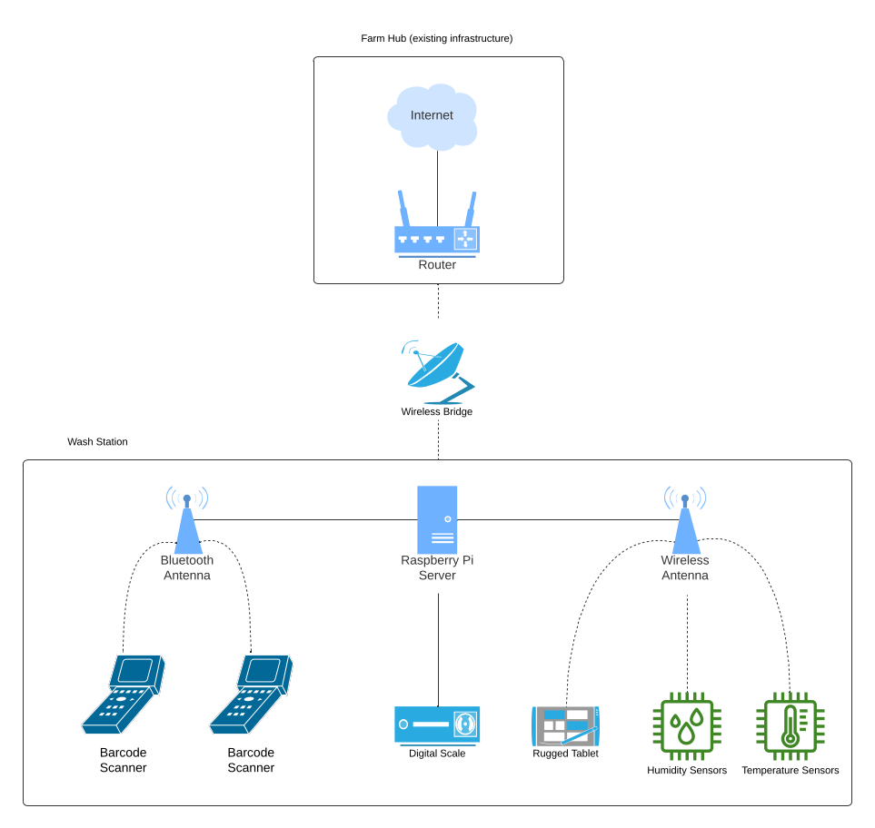
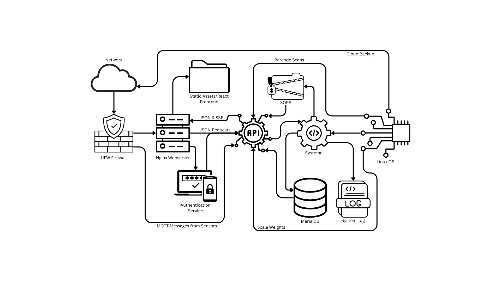

# TESC-Farm
The Evergreen State College Organic Farm Computer Science Project

## Collaborative Farm Proposal

We are excited to present our project proposal, which involves the
implementation of an automated data collection system for organic farm
harvest data. This initiative is a collaborative effort between the
Computer Science Department and the Organic Farm's Principles of Farming
class at Evergreen State College. The primary objective of this project
is to upgrade the new wash station with the necessary technology to
facilitate automated data collection of harvest data.

Specifically, our project aims to collect the weights of harvested
items, categorized into four main groups: \"To Market,\" \"To Student
Services,\" \"Cull,\" and \"Value Added.\" The \"To Market\" items are
of marketable quality and will be sold at the student-led organic farm
stand. \"To Student Services\" items, although visually imperfect, are
still of fair condition and will be provided to student services for
free distribution. The \"Value Added\" category includes items that,
while edible, are severely bruised and require transformation, such as
turning bruised apples into apple butter. The \"Cull\" items are
unsuitable for human consumption and will be composted to nourish future
crops.

The technical details of the data collection system are outlined in the
design document. In summary, weight data from scales will be fed into a
Raspberry Pi and displayed on a screen. Categorization will be managed
using barcode scanners to ensure speed and accuracy, akin to retail
inventory tracking systems. We have prioritized ease of maintenance and
durability in our hardware selections, allowing for minimal upkeep. When
maintenance is necessary, the required off-the-shelf parts are detailed
in the Bill of Materials and design document. Over the next quarter, we
will develop a maintenance guide that is user-friendly enough to be
managed by freshman CS students if there is interest. Another option for
long term maintenance is to use front desk workers, this would be a way
to increase community engagement and make the ACC more vibrant and see
increased usage. The maintenance document will be engineered for ease of
maintenance.

Our system is designed with long-term objectives in mind. While nothing
is entirely future-proof, this setup is highly resilient to future
developments. Utilizing a Raspberry Pi as the central hub allows for
connectivity with hexapod robots, sensory hubs for monitoring soil
moisture and nitrogen levels, and machine vision weed detection.

This comprehensive data collection will enable the organic farm to make
informed farming decisions. In the immediate term, the harvest data will
guide the farm in selecting the most financially sustainable crops.
Looking ahead, with potential regenerative farming faculty, hexapod
robots could monitor weeds and pests, aiding in the strategic release of
chickens to control pest insects. Continuous soil nutrient monitoring
through sensor clusters in the micro controllers class will provide farm
students with a more detailed understanding of soil conditions beyond
intermittent lab measurements. These data streams will also inform the
development of predictive mathematical models for nutrient cycling,
etc., to help develop upper division science curriculum on the farm.

All collected data will be open source, benefiting not only Evergreen
State College students but also local businesses and other agricultural
science departments. In 1975, students laid the foundation for the
farmhouse; in 2025 let students lay the foundation for a modern farm
that will serve for the next 50 years.

Thank you for considering our proposal. We look forward to your support
and collaboration on this trans-formative project.

Sincerely,

Students of the All Organic farm-Computer Science Collaboration team.

Evergreen State College

# Project Outline

### Project Overview

The proposed project aims to streamline the collection of harvest
weights across four main categories:

-   **To Market:** Items of high quality, ready for sale at the
    student-led organic farm stand.
-   **To Student Services:** Items with visual defects, donated to
    student services to provide free food for students.
-   **Value Added:** Items that, though severely bruised, can be
    transformed into products like apple butter.
-   **Cull:** Items unfit for human consumption, returned to compost for
    enriching the next crop cycle.

### Data Collection System

The automated data collection system will feature:

-   **Weight Measurement:** Weight data collected from scales will be
    processed using a Raspberry Pi and displayed on an interface screen.
-   **Categorization:** Bar code scanners will categorize items swiftly
    and accurately, akin to retail inventory systems.
-   **Hardware Considerations:** The selected hardware prioritizes ease
    of maintenance and durability, ensuring minimal need for repairs and
    straightforward replacement of parts as listed in the Bill of
    Materials and design document.

### Future-Proof Design

Our system is designed to be highly adaptable, enabling future
integrations such as:

-   **Hexapod Robots and Sensory Hubs:** For monitoring soil moisture
    and nitrogen levels.
-   **Machine Vision Weed Detection:** To optimize pest control and
    farming decisions.
-   **Nutrient Sensors:** Providing continuous, granular data on soil
    quality, including nitrates
-   **Moisture sensors:** Allowing us to implement algorithmic watering
    processes to optimize water use.
-   **Temperature Sensors:** Allow regulation of heated greenhouse to
    save energy.

### Implementation and Maintenance

Over the next quarter, we will develop a comprehensive maintenance guide
as we deploy our Data Collection System. designed to be user-friendly
for freshman CS students or Evergreen College IT staff. The long-term
vision includes integrating advanced technologies to support
regenerative farming practices and open-source data sharing to create
ties with farms in industry and other Agricultural science departments.

# Project Roster

This project would not be where it is today without the support of all
these driven individuals. Thank you, everyone. A special thanks to all
the faculty who provided letters of support.

## Faculty support

### Paul Pham, Ph.D., Computer Science

I teach upper-division computer science courses, including Data
Structures & Algorithms (DSA), \'23-\'24. In \'24-\'25, I'll also be
teaching in Advanced Computing & Machine Learning with Applications to
Biology (ACMLAB).

In Fall \'24, DSA students and I collaborated with Melissa Nivala and
Principles of Farming (POF) students to begin designing a data
automation and analysis system for Evergreen\'s Organic Farm. This
project is part of a long-term, interdisciplinary effort that will
support team-taught Coordinated Studies Programs, provide long-term
benefits to the College through durable equipment and sustainable food
systems, and give students opportunities for research and publication.

In Winter \'25, I'll lead a Student-Originated Studies (SOS) program
focused on farm automation. This program will include students from CS,
farming, and engineering, with clear design goals and user feedback from
farm students. In Spring \'25, ACMLAB will include a hexapod robotics
project with a camera and software to analyze 3D models of plants. This
work will support interdisciplinary teaching with biology and CS faculty
(Catherine Kehl and Pauline Yu). We aim to explore how Evergreen can
integrate CS with natural and agricultural sciences without compromising
the success of the existing CS curriculum. Our farm's expansive land and
flexible, self-driven student culture provide a unique advantage for
this effort, aligning with the College\'s goal of increasing enrollment
by 1,000 students.

In \'25-\'26, I'll teach evening PaCE courses focused on back-end
development and maintaining web services for farm automation. A
compelling website and online presence can be designed by students
taking front-end courses with faculty like Jes Carey and Arlen Speights.
Additionally, I'll assist in a faculty search for a DSA and SOS visiting
hire for the Olympia curriculum. The role will emphasize farm
collaboration as a unique intellectual and service-oriented opportunity.
This may align with the Regenerative Agriculture hire, who has shown
interest in using technology and data in their research.

I look forward to advising and helping design sustainable engineering
processes for this and future SOS programs and collaborating with
faculty and students at Evergreen.

Paul

### Melissa Nivala, Ph.D. Applied Mathematics

I am a core faculty member of the Food and Agriculture pathway,
focusing on quantitative analysis.  In Fall 2024, while teaching
Practices of Organic Farming (POF), the lack of data (collection,
transfer to electronic format, and transparent sharing) was identified
as a key bottleneck, impeding the ability of students to learn through a
quantitative framework.  Thus, I am heavily dedicated to this
collaborative project and will continue to support it throughout the
24-25 academic year and beyond.

My contributions in Winter and Spring \'25 will be advising DSA students
in the nature of the data, i.e. data management: what variables need to
be measured, which units and unit conversions are necessary, and how to
best disseminate the data for analysis to inform farm operations and
curriculum.  I will co-teach a Student Originated Studies program with
Paul Pham, and plan to visit the farm and the DSA students regularly to
ensure success of the project.  I will strive to make the data
transparently available, via a website or online repository, so it can
be used as a teaching tool in any program containing mathematics,
statistics, food and agriculture.

Longer term, I am heavily involved in the curriculum planning for the
next two academic years of farm curriculum and will be teaching on the
farm in \'25-\'26 and \'26-\'27.  This data management project will set
the stage for faculty to be able to develop rigorous, scientific
learning on the farm, ideally resulting in student led research projects
and upper division science credit offerings.  The plan to collect data
strongly aligns with the onboarding of a new faculty member in
Regenerative Organic Agriculture, supporting the new faculty in teaching
advanced soil science, quantitative agroecology, etc. and conducting
undergraduate scientific research.  I plan to collaborate with this new
faculty on undergraduate research, to develop mathematical models of
nutrient cycling, plant and organism growth and other concerns for
regenerative agriculture.  Development of these models will require fine
grained data collection, which is the main goal of this current project.

Thanks,\
Melissa

## Students

Following the esteemed faculty who guide and shape the academic journey
with their vast expertise and knowledge, we present our talented and
ambitious students. This section is dedicated to those who are embarking
on their path to greatness, ready to learn, grow, and make their mark on
the world.

### Austin Strayer

STEM student Senior -- Data structures and Algorithms -- Software
development, and data architecture.

### Dani Monroe

STEM student Sophomore -- Data structures and Algorithms -- Leadership,
Data science and, applied computational modeling

### Leif Mark George Fischer II

STEM student Junior -- Principals of farming -- Agricultural Ecology,
and Indigenous land practices \*this project bloomed from your idea\*

### Shawn Bird

STEM student Sophomore -- Data structures and Algorithms -- Technology
Consulting

# Hardware Overview

## Edge Server

The heart of the farm information system is a Raspberry Pi, using an SD
card for system storage. It's located in the wash room within a
waterproof enclosure.

-   **Raspberry Pi 4 8GB:** 8GB of ram for caching a robust assortment
    of data for rapid dissemination and manipulation. By using the
    Raspian OS it will be able to read data from multiple barcode
    scanners, scales, and other inputs; maintain an isolated wifi
    network and DNS service; host database, firewall, and web server
    systems; and facilitate IoT systems.
-   **32GB SanDisk Ultra Micro SD Card:** Simple system storage media
    that can easily be flashed and replaced at minimal cost. The 'ultra'
    speeds should keep boot and restart times to a minimum.
-   **Waterproof Enclosure:** An IP67 enclose is a necessity in the wet
    working environment of the wash room. This case has room for modules
    and expansion.
-   **USB-C Power Supply:** Simple power supply for testing and
    development, or any other time the server isn't running on solar
    power.

## User Interface

Users will interact with the information system through barcode
scanners, scales, tablets, and web browsers.

-   **Industrial Bluetooth Scanners:** Industrial barcode scanners which
    are dustproof, waterproof, battery powered, and communicate over
    bluetooth. The Raspberry Pi is able to interpret each scanner as a
    separate input, allowing for multiple simultaneous workflows.
-   **Rugged Tablet:** A waterproof wall mounted tablet to display
    current information, usable with a stylus even with gloves or dirty
    hands. Includes power supply for recharging.
-   **Tablet Wall Mount:** By mounting the tablet on the wall it can be
    visible to multiple workers at the same time.
-   **Waterproof Membrane Keyboard:** Bluetooth wireless waterproof
    QWERTY keyboard for use with the tablet.
-   **RS232 Adapter:** This adapter allows the Raspberry Pi to read the
    output from the scale, relieving the need to hand-record weights.
-   **RJ12 to DB9 Adapter:** Allows the solar charge controller to be
    connected to the RS232 adapter.

## Wireless

Wireless communication is essential for the cordless operation of
sensors and input devices with the server, as well as the bridge from
the farm hub to the wash station.

-   **Wireless Bridge:** The wireless bridge provides a secure
    end-to-end connection over long distances; it connects an ethernet
    port at the farm hub to an ethernet port in the wash station, as if
    they were directly plugged in to one another.
-   **Bluetooth 5.1 Antenna:** The Raspberry Pi has a default bluetooth
    range of about three feet, with this antenna we can extend the range
    over 100 feet.
-   **WiFi AC600 Antenna:** This wireless antenna vastly extends the
    wifi range of the Raspberry Pi, allowing it to oversee a mesh
    network connecting sensors and tablets in nearby fields.
-   **Antenna Extenders:** These cables allow an antenna to be
    positioned a short distance away from the receiver. Both the
    bluetooth and wifi antennas need to be positioned on the outside of
    the edge server enclosure for maximum effect.

## Solar

A modest solar panel connected to a charge controller and battery is
sufficient to reliably power the information system. Due to the low
power consumption of the Raspberry Pi, it is a strong candidate for
solar power sources.

-   **100W 12v Solar Panel:** With an average daily yield of 400 watts,
    a single solar panel is able to provide more than the 288 watts
    required to power a Raspberry Pi for 24 hours.
-   **Solar Panel Extension Cable:** These cables allow the solar panel
    to be placed at a distance from the battery and charge controller.
-   **12v Solar Charge Controller:** A charge controller is necessary to
    put the power from the solar panel into a battery. It can also be
    used to charge the battery with 12v current from a wall adapter.
-   **8ah LiFePO4 Battery:** Durable, compact and sealed battery storage
    with plenty of capacity for connected systems.
-   **12v to 5v DC Buck Converter:** This device converts the 12v power
    from the battery and solar panel into 5v power required by the
    Raspberry Pi.
-   **12v DC Power Supply:** Simple power supply to charge the battery
    in case solar power ever falls short.
-   **12v Waterproof Relay:** A switch to toggle the 12v power supply,
    controlled by the Raspberry Pi.

## Sensors

An array of sensors monitoring growing conditions in multiple areas can
be connected into a mesh network and leveraged to collect invaluable
data.

-   **ESP32 Modules:** Low power wifi-connected micro controllers
    compatible with a variety of sensors and powered by a small battery.
-   **Soil Moisture Sensors:** Ground probes to detect the humidity
    level in soil.
-   **Temperature Sensors:** Durable waterproof temperature probes.
-   **Light Sensors:** Basic light intensity sensors.
-   **3000mAh Batteries:** Rechargable batteries for ESP32 capable of
    powering the devices for several days of operation.
-   **6 Channel Battery Charger:** Battery charging unit capable of
    recharging half a dozen batteries at a time for the ESP32s.
-   **Solar Sensor Charger:** Miniature solar panel and charge
    controller made for an ESP32 to keep the battery perpetually
    charged.

# Systems Overview

## Database

## Server

## API
Compiled API written in Go to collect data for labor, harvests, and sales.

### Labor Endpoints:
- GET  /hours
- GET  /hours/:id
- POST /hours/new
- POST /hours/:id/update
- POST /hours/:id/delete
- GET  /workers
- GET  /worker/:id
- GET  /worker/:id/hours
- POST /worker/new
- POST /worker/:id/update
- POST /worker/:id/delete

### Harvest Endpoints:
- GET  /crops
- GET  /crop/:id
- GET  /crop/:id/harvests
- GET  /crop/:id/processing
- POST /crop/new
- POST /crop/:id/update
- POST /crop/:id/delete
- GET  /harvests
- GET  /harvest/:id
- GET  /harvest/:id/processing
- POST /harvest/new
- POST /harvest/:id/update
- POST /harvest/:id/delete
- GET  /processing
- GET  /process/:id
- POST /process/new
- POST /process/:id/update
- POST /process/:id/delete
- GET  /bin/:bin/harvest

### Sales Endpoints:
- GET  /products
- GET  /product/:id
- GET  /product/:id/sales
- POST /product/new
- POST /product/:id/update
- POST /product/:id/delete
- GET  /sales
- GET  /sale/:id
- POST /sale/new
- POST /sale/:id/update
- POST /sale/:id/delete
